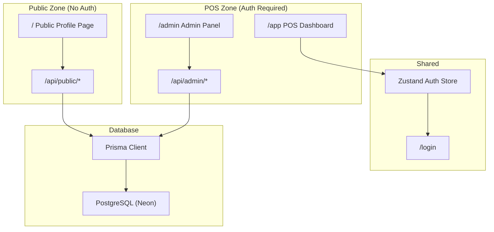
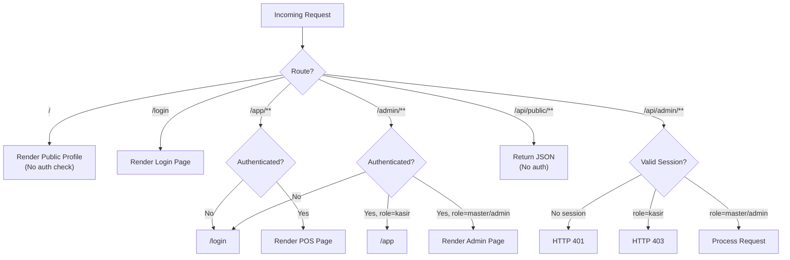

# Design Document: Public Profile & Admin Panel

## Overview

Fitur ini menambahkan dua area baru ke aplikasi Gerai BKMT yang sudah ada:

1. **Halaman Profil Publik** (`/`) — halaman yang dapat diakses tanpa login, menampilkan identitas organisasi PD BKMT Kubu Raya, berita/pengumuman, daftar pengurus, dan informasi gerai.
2. **Admin Panel** (`/admin`) — antarmuka pengelolaan konten profil publik, hanya dapat diakses oleh pengguna dengan role `master` atau `admin`.

Selain itu, sistem kasir yang saat ini berada di route `/` dipindahkan ke `/app`, sehingga route `/` bebas digunakan sebagai halaman publik.

### Keputusan Desain Utama

- **Routing restrukturisasi**: `AuthProvider` dan `Sidebar` dimodifikasi agar route `/` dan `/admin` diperlakukan berbeda dari route POS.
- **API terpisah**: Endpoint publik di `/api/public/*` tidak memerlukan autentikasi; endpoint admin di `/api/admin/*` memerlukan sesi valid dengan role `master`/`admin`.
- **Prisma schema extension**: Empat model baru ditambahkan ke schema yang sudah ada tanpa mengubah model yang sudah ada.
- **Server Components untuk halaman publik**: Halaman `/` menggunakan Next.js Server Components untuk fetch data langsung dari Prisma, sehingga SEO-friendly dan tidak memerlukan client-side fetch.
- **Client Components untuk admin panel**: Form-form di `/admin` menggunakan Client Components karena memerlukan interaktivitas.

---

## Architecture

### Diagram Arsitektur Tingkat Tinggi



### Diagram Alur Routing



### Struktur Direktori Baru

```
src/
├── app/
│   ├── page.tsx                    ← DIGANTI: Public Profile Page (Server Component)
│   ├── app/                        ← BARU: POS System (dipindah dari /)
│   │   ├── layout.tsx              ← Layout POS dengan Sidebar
│   │   └── page.tsx                ← Dashboard POS (dipindah dari /)
│   ├── admin/                      ← BARU: Admin Panel
│   │   ├── layout.tsx              ← Layout Admin
│   │   ├── page.tsx                ← Dashboard Admin
│   │   ├── profil/page.tsx         ← Form edit profil organisasi
│   │   ├── berita/
│   │   │   ├── page.tsx            ← Daftar berita
│   │   │   ├── baru/page.tsx       ← Form buat berita baru
│   │   │   └── [id]/page.tsx       ← Form edit berita
│   │   ├── pengurus/
│   │   │   ├── page.tsx            ← Daftar pengurus
│   │   │   ├── baru/page.tsx       ← Form tambah pengurus
│   │   │   └── [id]/page.tsx       ← Form edit pengurus
│   │   └── gerai/page.tsx          ← Form edit informasi gerai
│   ├── berita/
│   │   └── [slug]/page.tsx         ← BARU: Detail berita publik
│   └── api/
│       ├── public/                 ← BARU: Public API endpoints
│       │   ├── profil/route.ts
│       │   ├── berita/route.ts
│       │   ├── berita/[slug]/route.ts
│       │   ├── pengurus/route.ts
│       │   └── gerai/route.ts
│       └── admin/                  ← BARU: Admin API endpoints
│           ├── profil/route.ts
│           ├── berita/route.ts
│           ├── berita/[id]/route.ts
│           ├── pengurus/route.ts
│           ├── pengurus/[id]/route.ts
│           └── gerai/route.ts
└── components/
    ├── layout/
    │   ├── AuthProvider.tsx         ← DIMODIFIKASI: exclude "/" dan "/admin"
    │   └── Sidebar.tsx              ← DIMODIFIKASI: tambah menu Admin
    └── public/                      ← BARU: Komponen halaman publik
        ├── PublicHeader.tsx
        ├── HeroSection.tsx
        ├── BeritaSection.tsx
        ├── PengurusSection.tsx
        └── GeraiSection.tsx
```

---

## Components and Interfaces

### 1. Modifikasi AuthProvider

`AuthProvider` saat ini memaksa redirect ke `/login` untuk semua route yang tidak diautentikasi. Perlu dimodifikasi untuk mengecualikan route publik:

```typescript
// src/components/layout/AuthProvider.tsx
const PUBLIC_ROUTES = ["/", "/login"];
const isPublicRoute = PUBLIC_ROUTES.includes(pathname) || 
                      pathname.startsWith("/berita/") ||
                      pathname.startsWith("/api/public/");

// Logika baru:
// - Jika public route → render children tanpa cek auth
// - Jika /admin/** dan role kasir → redirect ke /app
// - Jika /app/** dan tidak auth → redirect ke /login
```

### 2. Layout Terpisah untuk POS dan Admin

Saat ini `src/app/layout.tsx` (root layout) selalu merender `Sidebar`. Dengan adanya halaman publik, perlu ada pemisahan layout:

- **Root layout** (`src/app/layout.tsx`): Hanya menyediakan `<html>`, `<body>`, `Toaster`. Tidak lagi merender `Sidebar` atau `AuthProvider` secara global.
- **POS layout** (`src/app/app/layout.tsx`): Merender `AuthProvider` + `Sidebar` untuk semua route POS.
- **Admin layout** (`src/app/admin/layout.tsx`): Merender `AuthProvider` + sidebar admin untuk semua route admin.
- **Public layout**: Tidak ada layout khusus; halaman publik merender komponen navigasi sendiri.

### 3. Komponen Halaman Publik

#### `PublicHeader`
Navbar halaman publik dengan logo BKMT, navigasi anchor ke seksi-seksi halaman, dan tombol "Login ke Kasir".

```typescript
interface PublicHeaderProps {
  orgName: string;
  logoUrl?: string;
}
```

#### `HeroSection`
Menampilkan nama organisasi, deskripsi singkat, visi, dan misi.

```typescript
interface HeroSectionProps {
  profil: ProfilOrganisasiPublic | null;
}
```

#### `BeritaSection`
Menampilkan grid kartu berita terbaru (maksimal 6 berita). Setiap kartu dapat diklik untuk membuka halaman detail berita.

```typescript
interface BeritaSectionProps {
  beritaList: BeritaPublic[];
}
```

#### `PengurusSection`
Menampilkan pengurus dikelompokkan berdasarkan tingkatan (PD → PC → Permata).

```typescript
interface PengurusSectionProps {
  pengurusList: PengurusPublic[];
}
```

#### `GeraiSection`
Menampilkan informasi operasional gerai.

```typescript
interface GeraiSectionProps {
  gerai: InformasiGeraiPublic | null;
}
```

### 4. Admin Panel Components

#### `AdminSidebar`
Sidebar khusus admin panel dengan navigasi ke: Dashboard, Profil Organisasi, Berita, Pengurus, Informasi Gerai, dan tautan ke POS System.

#### Form Components
Setiap entitas memiliki form component tersendiri yang menggunakan React state dan fetch ke API admin:
- `ProfilForm` — form edit profil organisasi
- `BeritaForm` — form buat/edit berita dengan auto-slug generation
- `PengurusForm` — form tambah/edit pengurus dengan dropdown tingkatan
- `GeraiForm` — form edit informasi gerai

### 5. API Route Handlers

#### Public API (tidak memerlukan auth)

| Method | Endpoint | Deskripsi |
|--------|----------|-----------|
| GET | `/api/public/profil` | Data profil organisasi |
| GET | `/api/public/berita` | Daftar berita published |
| GET | `/api/public/berita/[slug]` | Detail berita by slug |
| GET | `/api/public/pengurus` | Daftar pengurus aktif |
| GET | `/api/public/gerai` | Informasi gerai |

#### Admin API (memerlukan auth role master/admin)

| Method | Endpoint | Deskripsi |
|--------|----------|-----------|
| GET/PUT | `/api/admin/profil` | Baca/update profil organisasi |
| GET/POST | `/api/admin/berita` | Daftar/buat berita |
| GET/PUT/DELETE | `/api/admin/berita/[id]` | Baca/update/hapus berita |
| GET/POST | `/api/admin/pengurus` | Daftar/tambah pengurus |
| GET/PUT/DELETE | `/api/admin/pengurus/[id]` | Baca/update/hapus pengurus |
| GET/PUT | `/api/admin/gerai` | Baca/update informasi gerai |

#### Auth Middleware untuk Admin API

Setiap admin API route handler akan memanggil helper `requireAdminAuth()`:

```typescript
// src/lib/auth-middleware.ts
export async function requireAdminAuth(request: NextRequest): Promise<
  { user: SessionUser } | NextResponse
> {
  // 1. Baca cookie sesi atau header Authorization
  // 2. Jika tidak ada sesi → return NextResponse dengan status 401
  // 3. Jika role kasir → return NextResponse dengan status 403
  // 4. Jika valid → return { user }
}
```

Karena aplikasi saat ini menggunakan Zustand persist (client-side only), autentikasi API admin akan menggunakan **cookie sesi** yang di-set saat login. Login API (`/api/auth/login`) perlu dimodifikasi untuk menyimpan sesi di cookie HTTP-only.

---

## Data Models

### Skema Prisma Baru

Empat model baru ditambahkan ke `prisma/schema.prisma`:

```prisma
model ProfilOrganisasi {
  id          String   @id @default(cuid())
  nama        String
  singkatan   String?
  deskripsi   String?  @db.Text
  visi        String?  @db.Text
  misi        String?  @db.Text
  sejarah     String?  @db.Text
  logoUrl     String?
  email       String?
  telepon     String?
  alamat      String?
  facebook    String?
  instagram   String?
  youtube     String?
  website     String?
  createdAt   DateTime @default(now())
  updatedAt   DateTime @updatedAt
}

model Berita {
  id              String    @id @default(cuid())
  judul           String
  slug            String    @unique
  konten          String    @db.Text
  ringkasan       String?   @db.Text
  gambarUrl       String?
  status          String    @default("draft")  // "draft" | "published"
  tanggalPublikasi DateTime?
  penulisId       String?
  penulis         User?     @relation(fields: [penulisId], references: [id])
  createdAt       DateTime  @default(now())
  updatedAt       DateTime  @updatedAt
}

model Pengurus {
  id         String   @id @default(cuid())
  nama       String
  nik        String?
  alamat     String?
  jabatan    String
  tingkatan  String   // "PD" | "PC" | "Permata"
  periode    String?
  fotoUrl    String?
  urutan     Int      @default(0)
  aktif      Boolean  @default(true)
  createdAt  DateTime @default(now())
  updatedAt  DateTime @updatedAt
}

model InformasiGerai {
  id              String   @id @default(cuid())
  nama            String
  alamat          String
  jamOperasional  String?
  telepon         String?
  deskripsi       String?  @db.Text
  latitude        Float?
  longitude       Float?
  createdAt       DateTime @default(now())
  updatedAt       DateTime @updatedAt
}
```

Model `User` yang sudah ada perlu ditambahkan relasi ke `Berita`:

```prisma
model User {
  // ... field yang sudah ada ...
  berita    Berita[]   // ← tambahkan relasi ini
}
```

### TypeScript Interface untuk API Response

```typescript
// src/types/public-profile.ts

export interface ProfilOrganisasiPublic {
  id: string;
  nama: string;
  singkatan?: string;
  deskripsi?: string;
  visi?: string;
  misi?: string;
  sejarah?: string;
  logoUrl?: string;
  email?: string;
  telepon?: string;
  alamat?: string;
  facebook?: string;
  instagram?: string;
  youtube?: string;
  website?: string;
}

export interface BeritaPublic {
  id: string;
  judul: string;
  slug: string;
  ringkasan?: string;
  gambarUrl?: string;
  tanggalPublikasi?: string;
  penulis?: { nama: string };
}

export interface BeritaDetailPublic extends BeritaPublic {
  konten: string;
}

export interface PengurusPublic {
  id: string;
  nama: string;
  jabatan: string;
  tingkatan: "PD" | "PC" | "Permata";
  periode?: string;
  fotoUrl?: string;
  urutan: number;
}

export interface InformasiGeraiPublic {
  id: string;
  nama: string;
  alamat: string;
  jamOperasional?: string;
  telepon?: string;
  deskripsi?: string;
  latitude?: number;
  longitude?: number;
}

export interface ApiResponse<T> {
  data: T;
  error?: string;
}
```

### Slug Generation

Slug berita di-generate dari judul menggunakan fungsi utilitas:

```typescript
// src/lib/utils.ts (tambahan)
export function generateSlug(judul: string): string {
  return judul
    .toLowerCase()
    .replace(/[^a-z0-9\s-]/g, "")   // hapus karakter non-alphanumeric
    .replace(/\s+/g, "-")            // spasi → tanda hubung
    .replace(/-+/g, "-")             // multiple tanda hubung → satu
    .trim();
}
```

Jika slug sudah ada, sistem menambahkan suffix numerik: `judul-berita-2`, `judul-berita-3`, dst.

### Session Cookie untuk Auth API

Login API dimodifikasi untuk menyimpan data user di cookie HTTP-only:

```typescript
// Di /api/auth/login/route.ts
response.cookies.set("session", JSON.stringify({ 
  id: user.id, 
  role: user.role, 
  nama: user.nama 
}), {
  httpOnly: true,
  secure: process.env.NODE_ENV === "production",
  sameSite: "lax",
  maxAge: 60 * 60 * 24 * 7, // 7 hari
});
```

---

## Correctness Properties

*A property is a characteristic or behavior that should hold true across all valid executions of a system — essentially, a formal statement about what the system should do. Properties serve as the bridge between human-readable specifications and machine-verifiable correctness guarantees.*

### Property 1: Slug generation menghasilkan karakter yang valid dan deterministik

*For any* string judul berita (termasuk karakter Unicode, spasi, tanda baca), fungsi `generateSlug` harus selalu menghasilkan string yang sama untuk input yang sama, dan hasilnya harus hanya mengandung karakter huruf kecil latin, angka, dan tanda hubung.

**Validates: Requirements 5.3**

### Property 2: Slug yang dihasilkan selalu unik dari daftar yang sudah ada

*For any* daftar slug yang sudah ada dan judul berita baru, fungsi `ensureUniqueSlug` harus menghasilkan slug yang tidak ada dalam daftar tersebut — baik slug dasar maupun slug dengan suffix numerik.

**Validates: Requirements 3.6, 9.4**

### Property 3: Berita yang di-publish selalu memiliki tanggal publikasi

*For any* berita dengan status `published` (baik yang baru dibuat maupun yang diubah dari draft), field `tanggalPublikasi` tidak boleh null — jika tidak diisi secara eksplisit, sistem harus menetapkannya ke waktu saat ini.

**Validates: Requirements 5.7**

### Property 4: Pengurus aktif selalu diurutkan berdasarkan tingkatan lalu urutan

*For any* daftar pengurus aktif dengan berbagai kombinasi tingkatan dan nilai urutan, fungsi `sortPengurus` harus menghasilkan daftar di mana semua pengurus `PD` muncul sebelum `PC`, semua `PC` muncul sebelum `Permata`, dan di dalam setiap tingkatan diurutkan berdasarkan nilai `urutan` secara ascending.

**Validates: Requirements 6.7, 8.4**

### Property 5: Filter berita hanya meloloskan status published

*For any* daftar berita dengan campuran status `draft` dan `published`, fungsi filter berita publik harus menghasilkan daftar yang semua elemennya memiliki status `published` — tidak ada satu pun berita `draft` yang lolos.

**Validates: Requirements 5.8, 8.2**

### Property 6: Semua endpoint admin menolak akses tidak sah

*For any* endpoint admin (`/api/admin/*`) dan *for any* request tanpa sesi autentikasi yang valid, sistem harus mengembalikan HTTP 401. *For any* request dari pengguna dengan role `kasir`, sistem harus mengembalikan HTTP 403.

**Validates: Requirements 9.1, 9.2, 9.3**

### Property 7: Update data melalui admin API mengembalikan data terbaru

*For any* data konten yang valid (profil, berita, pengurus, atau gerai) yang dikirim melalui endpoint admin PUT, respons sukses harus mengandung data yang sama persis dengan yang dikirim — tidak ada field yang hilang atau berubah secara tidak terduga.

**Validates: Requirements 9.6**

---

## Error Handling

### Strategi Error Handling per Layer

#### API Layer

| Kondisi | HTTP Status | Respons |
|---------|-------------|---------|
| Slug berita tidak ditemukan | 404 | `{ "error": "Berita tidak ditemukan" }` |
| Request tanpa sesi ke admin API | 401 | `{ "error": "Autentikasi diperlukan" }` |
| Request dari role kasir ke admin API | 403 | `{ "error": "Akses ditolak" }` |
| Slug duplikat saat buat berita | 409 | `{ "error": "Slug sudah digunakan, coba judul yang berbeda" }` |
| Validasi gagal (field kosong) | 400 | `{ "error": "Nama organisasi tidak boleh kosong" }` |
| Error database/server | 500 | `{ "error": "Terjadi kesalahan server" }` |

#### UI Layer (Admin Panel)

- **Validasi client-side**: Form memvalidasi field wajib sebelum submit untuk memberikan feedback instan.
- **Error dari server**: Pesan error dari API ditampilkan di bawah form menggunakan komponen `toast` (sonner) yang sudah ada.
- **Data tidak hilang**: Jika request gagal, form tidak di-reset — data yang sudah diisi tetap ada.
- **Loading state**: Tombol submit menampilkan spinner dan di-disable selama request berlangsung.

#### Halaman Publik

- **Data tidak tersedia**: Setiap seksi halaman publik menampilkan konten placeholder yang informatif jika data belum ada di database (misalnya: "Informasi profil sedang dipersiapkan").
- **Berita tidak ditemukan**: Halaman `/berita/[slug]` menampilkan halaman 404 menggunakan `notFound()` dari Next.js.
- **Error fetch**: Halaman publik menggunakan Server Components; jika fetch gagal, Next.js error boundary menangani tampilan error.

### Validasi Data

| Entitas | Field Wajib | Validasi Tambahan |
|---------|-------------|-------------------|
| ProfilOrganisasi | `nama` | Tidak boleh kosong |
| Berita | `judul`, `konten` | Slug unik; `tanggalPublikasi` auto-set saat publish |
| Pengurus | `nama`, `jabatan` | `tingkatan` harus salah satu dari: PD, PC, Permata |
| InformasiGerai | `nama`, `alamat` | Tidak boleh kosong |

---

## Testing Strategy

### Pendekatan Pengujian

Fitur ini menggunakan **dual testing approach**:
1. **Unit tests** — untuk fungsi utilitas murni (slug generation, validasi)
2. **Property-based tests** — untuk memverifikasi properti universal yang harus berlaku di semua input
3. **Integration tests** — untuk API routes dan interaksi database

### Property-Based Testing

Fitur ini **sesuai** untuk property-based testing pada lapisan logika bisnis murni (slug generation, sorting, filtering), karena:
- Fungsi-fungsi tersebut adalah pure functions dengan input/output yang jelas
- Ada properti universal yang harus berlaku untuk semua input (slug hanya berisi karakter valid, urutan pengurus selalu konsisten)
- Input space cukup besar (berbagai kombinasi judul, karakter Unicode, dll.)

**Library yang digunakan**: [`fast-check`](https://github.com/dubzzz/fast-check) — library PBT untuk TypeScript/JavaScript.

```bash
npm install --save-dev fast-check
```

**Konfigurasi**: Setiap property test dijalankan minimum **100 iterasi**.

**Tag format**: `// Feature: public-profile-admin, Property {N}: {deskripsi}`

#### Property Tests yang Akan Diimplementasikan

**Property 1 — Slug generation deterministik dan karakter valid:**
```typescript
// Feature: public-profile-admin, Property 1: slug generation menghasilkan karakter yang valid dan deterministik
fc.assert(fc.property(
  fc.string({ minLength: 1 }),
  (judul) => {
    const slug1 = generateSlug(judul);
    const slug2 = generateSlug(judul);
    // Deterministik: dua panggilan dengan input sama menghasilkan output sama
    // Karakter valid: hanya huruf kecil, angka, tanda hubung
    return slug1 === slug2 && /^[a-z0-9-]*$/.test(slug1);
  }
), { numRuns: 100 });
```

**Property 2 — Slug yang dihasilkan selalu unik dari daftar yang sudah ada:**
```typescript
// Feature: public-profile-admin, Property 2: slug yang dihasilkan selalu unik dari daftar yang sudah ada
fc.assert(fc.property(
  fc.array(fc.string({ minLength: 1 }).filter(s => /^[a-z0-9-]+$/.test(s))),
  fc.string({ minLength: 1 }),
  (existingSlugs, judul) => {
    const baseSlug = generateSlug(judul);
    const newSlug = ensureUniqueSlug(baseSlug, existingSlugs);
    return !existingSlugs.includes(newSlug);
  }
), { numRuns: 100 });
```

**Property 3 — Berita yang di-publish selalu memiliki tanggal publikasi:**
```typescript
// Feature: public-profile-admin, Property 3: berita yang di-publish selalu memiliki tanggalPublikasi
fc.assert(fc.property(
  fc.record({
    status: fc.constant("published"),
    tanggalPublikasi: fc.option(fc.date(), { nil: undefined }),
  }),
  (beritaInput) => {
    const result = applyPublishLogic(beritaInput);
    return result.tanggalPublikasi !== null && result.tanggalPublikasi !== undefined;
  }
), { numRuns: 100 });
```

**Property 4 — Pengurus aktif selalu diurutkan berdasarkan tingkatan lalu urutan:**
```typescript
// Feature: public-profile-admin, Property 4: pengurus aktif selalu diurutkan berdasarkan tingkatan lalu urutan
const TINGKATAN_ORDER: Record<string, number> = { PD: 0, PC: 1, Permata: 2 };
fc.assert(fc.property(
  fc.array(fc.record({
    tingkatan: fc.oneof(fc.constant("PD"), fc.constant("PC"), fc.constant("Permata")),
    urutan: fc.integer({ min: 0, max: 1000 }),
    aktif: fc.constant(true),
  })),
  (pengurusList) => {
    const sorted = sortPengurus(pengurusList);
    for (let i = 0; i < sorted.length - 1; i++) {
      const currOrder = TINGKATAN_ORDER[sorted[i].tingkatan];
      const nextOrder = TINGKATAN_ORDER[sorted[i + 1].tingkatan];
      if (currOrder > nextOrder) return false;
      if (currOrder === nextOrder && sorted[i].urutan > sorted[i + 1].urutan) return false;
    }
    return true;
  }
), { numRuns: 100 });
```

**Property 5 — Filter berita hanya meloloskan status published:**
```typescript
// Feature: public-profile-admin, Property 5: filter berita hanya meloloskan status published
fc.assert(fc.property(
  fc.array(fc.record({
    status: fc.oneof(fc.constant("draft"), fc.constant("published")),
    judul: fc.string({ minLength: 1 }),
    slug: fc.string({ minLength: 1 }),
  })),
  (beritaList) => {
    const result = filterPublishedBerita(beritaList);
    return result.every((b) => b.status === "published");
  }
), { numRuns: 100 });
```

**Property 6 — Semua endpoint admin menolak akses tidak sah:**
```typescript
// Feature: public-profile-admin, Property 6: semua endpoint admin menolak akses tidak sah
const ADMIN_ENDPOINTS = [
  "/api/admin/profil",
  "/api/admin/berita",
  "/api/admin/pengurus",
  "/api/admin/gerai",
];
fc.assert(fc.property(
  fc.oneof(
    fc.constant(null),                    // tanpa sesi
    fc.constant({ role: "kasir" }),       // role kasir
  ),
  fc.constantFrom(...ADMIN_ENDPOINTS),
  async (session, endpoint) => {
    const status = await callEndpoint(endpoint, session);
    if (session === null) return status === 401;
    if (session.role === "kasir") return status === 403;
    return true;
  }
), { numRuns: 100 });
```

**Property 7 — Update data melalui admin API mengembalikan data terbaru:**
```typescript
// Feature: public-profile-admin, Property 7: update data melalui admin API mengembalikan data terbaru
fc.assert(fc.property(
  fc.record({
    nama: fc.string({ minLength: 1 }),
    deskripsi: fc.option(fc.string()),
    alamat: fc.option(fc.string()),
  }),
  async (updateData) => {
    const response = await putAdminProfil(updateData, adminSession);
    return response.data.nama === updateData.nama;
  }
), { numRuns: 100 });
```

### Unit Tests

- `generateSlug("")` → mengembalikan string kosong atau string default
- `generateSlug("Berita Terbaru BKMT!")` → `"berita-terbaru-bkmt"`
- `generateSlug("Kegiatan Ramadhan 1445 H")` → `"kegiatan-ramadhan-1445-h"`
- Form validation: submit dengan judul kosong → error ditampilkan
- Auth middleware: request tanpa cookie → 401; role kasir → 403

### Integration Tests

- `GET /api/public/berita` → hanya mengembalikan berita published
- `GET /api/public/berita/[slug-tidak-ada]` → HTTP 404
- `POST /api/admin/berita` tanpa auth → HTTP 401
- `POST /api/admin/berita` dengan role kasir → HTTP 403
- `POST /api/admin/berita` dengan slug duplikat → HTTP 409

### Testing Tools

- **Test runner**: Jest (atau Vitest — perlu ditambahkan ke devDependencies)
- **PBT library**: `fast-check`
- **API testing**: `supertest` atau Next.js route handler testing utilities
